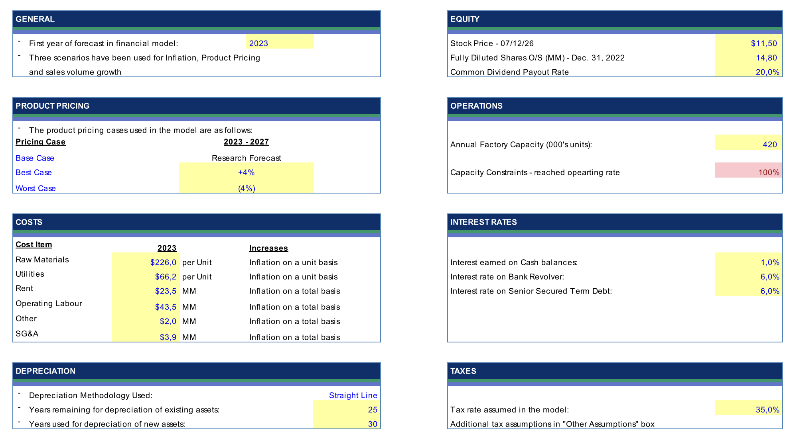
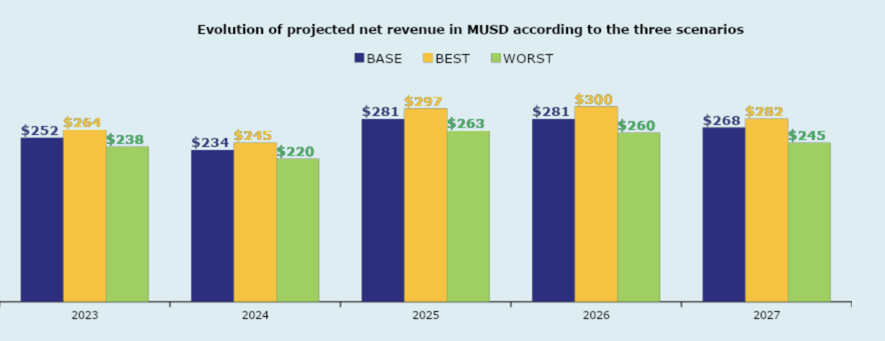
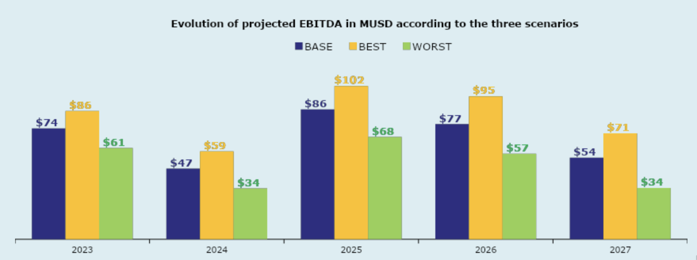
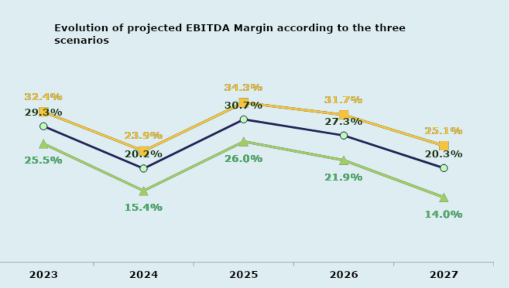
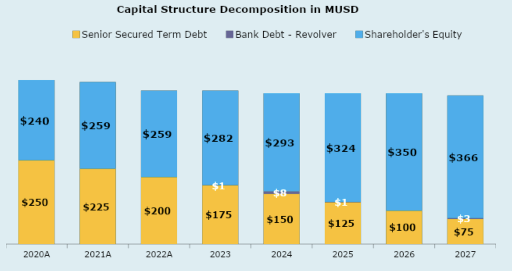
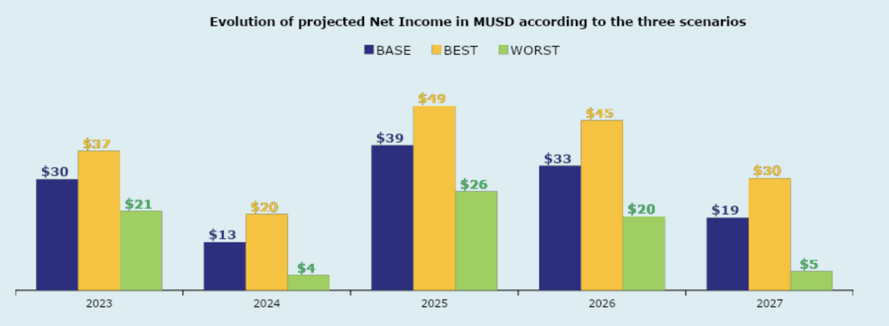

# Integrated Three-Statement Financial Model | Blu Containers

This project consists of a fully integrated three-statement financial model developed in Microsoft Excel to forecast Blu Containers' financial performance over a five-year horizon (2023–2027).

The model links the Income Statement, Balance Sheet, Cash Flow Statement, and supporting schedules through dynamic formulas and incorporates scenario analysis, debt modelling, and liquidity forecasting to evaluate the impact of different operating assumptions on financial performance.

The model was built following financial modelling best practices, with fully linked schedules, dynamic assumptions, and automated outputs to support financial planning and scenario analysis.
## Model Features

- Fully integrated Income Statement, Balance Sheet and Cash Flow Statement
- Dynamic scenario switch (Base / Best / Worst Case)
- Automated debt schedule with revolving credit facility
- Working capital forecasting
- Capacity-constrained production modelling
- Integrated tax schedule
- Five-year financial projections
---

## Project Architecture
### 1. Assumptions & Scenario Controls
Key modelling assumptions include:

• Dynamic pricing and sales volume assumptions
• Production capacity constraints
• Variable and fixed operating cost inflation
• Scenario-specific macroeconomic assumptions

**Base Case** (Research Forecast), **Best Case** (+4% Pricing / High Growth), and **Worst Case** (-4% Pricing / High Inflation). 
* Volume Constraints: Sales volume growth is modeled at 5.0% for 2023 and 4.0% thereafter. Crucially, the model incorporates an absolute production capacity wall at **420,000 units/year**, which forces unconstrained growth to cap out and hit 100% capacity utilization by 2027 under the Base Case.
* Cost Structures: Variable inputs (Raw Materials at $226/unit and Utilities at $66.2/unit) and fixed overheads ($69.0M total in 2023) scale annually based on scenario-specific inflation rates.

### 2. Income Statement Analysis
The Income Statement forecasts revenue, operating expenses, EBITDA, EBIT and Net Income over the five-year projection period based on the selected operating scenario.

The model links pricing assumptions, production volumes, capacity constraints and operating costs to evaluate their impact on profitability and margin evolution. It also captures the sensitivity of earnings under different macroeconomic environments.

Key outputs include:
- Revenue forecast
- EBITDA and EBITDA margin
- EBIT
- Net Income

Under the Base Case, lower selling prices in 2024 reduce EBITDA and temporarily compress operating margins before profitability recovers as pricing improves.

### 3. Balance Sheet & Capital Structure
The Balance Sheet is fully integrated with the Income Statement and Cash Flow Statement, ensuring that Assets equal Liabilities and Shareholders' Equity throughout the forecast period.

The model projects working capital, fixed assets, debt balances, deferred taxes, and shareholders' equity while automatically reflecting the impact of operational performance and financing decisions.

### 4. Net Income Performance

* **Scenario Divergence:** The chart illustrates the massive impact of operating leverage. In the Worst Case, persistent inflation and a 14% margin drop crush Net Income to $5M by 2027, whereas the Best Case captures the full upside of higher pricing with no added interest burdens.

### 5. Debt & Credit Liquidity Schedule
The debt schedule models the company's financing structure over the projection horizon through an integrated term loan and revolving credit facility.

The schedule automatically calculates:

- Mandatory debt amortization
- Revolving credit facility drawdowns and repayments
- Interest expense
- Cash sweep mechanics
- Ending cash balances

### 6. Scenario Analysis Insights
The scenario engine allows users to instantly compare the financial impact of three operating environments by changing a single scenario selector.

The analysis demonstrates how variations in pricing, inflation, and operating assumptions affect profitability, liquidity, leverage, and cash generation.
While the **Base Case** highlights a temporary $7.7M liquidity crunch in 2024, the model proves resilient across other environments:
* **Best Case (+4% Pricing):** Stronger pricing eliminates the need for any major Revolver drawdown, allowing the company to build a substantial cash buffer by 2027.
* **Worst Case (-4% Pricing & High Inflation):** Severe margin compression occurs. Profitability drops, forcing a continuous reliance on the Revolving Credit Facility to sustain the mandatory $25M annual debt service.

*To explore these outcomes dynamically, users can simply open the file and toggle the **Scenario Switch** on the model sheet.*

## Skills Demonstrated

• Three-Statement financial modelling

• Financial forecasting

• Scenario analysis

• Working capital forecasting

• Debt & Revolver modelling

• Liquidity analysis

• Capital Structure analysis

• Financial Statement integration

• Microsoft Excel
